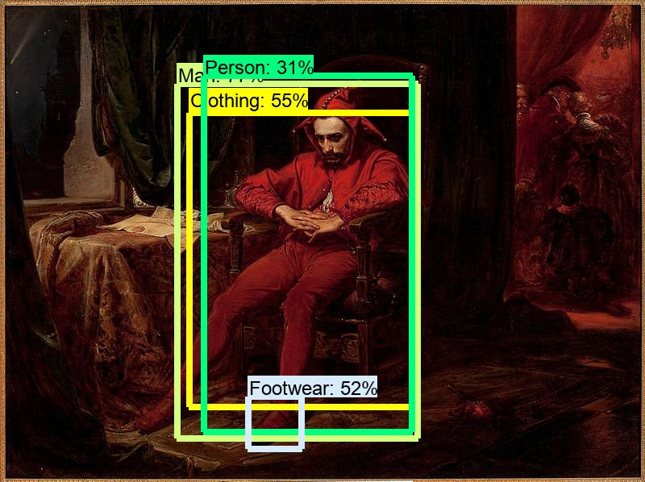

# Skarby muzeum

**Znajdź ukryte szczegóły na obrazach!**

[](http://p.migdal.pl/hackart-you-in-artwork/)

* [Demo video](https://www.youtube.com/watch?v=9uqrdjAgZxg)

[](https://www.youtube.com/watch?v=9uqrdjAgZxg)

* [Demo website](http://p.migdal.pl/hackart-you-in-artwork/)

**1 miejsce** w [HackArt  ⁄ Hackathon MNW](https://hackathon.mnw.art.pl/), 26-27 ma­ja 2018, Mu­zeum Na­ro­do­we w War­sza­wie.

## Skład

* [Agata Chęcińska](https://www.linkedin.com/in/agata-checinska-phd-0b321b1/)
* [Karol Majek](https://karolmajek.pl/)
* [Piotr Migdał](https://p.migdal.pl/)
* [Aleksandra Rutkowska](https://twitter.com/aleks_rutkowska)
* Paweł Zięcina

## Aplikacja

[](http://p.migdal.pl/hackart-you-in-artwork/)

[](http://p.migdal.pl/hackart-you-in-artwork/)

## Technical notes

## Object detection

### Google Cloud Vision API

Demo: https://cloud.google.com/vision/

Code: https://github.com/stared/hackart-you-in-artwork/blob/master/scripts_karol/gcp-vision.py

Result: https://github.com/stared/hackart-you-in-artwork/blob/master/data/gcp-vision.json

### Tensorflow Object detection API

TF OD API: https://github.com/tensorflow/models/tree/master/research/object_detection

Labels (Open Images v3 bbox - 545 classes) - https://github.com/tensorflow/models/blob/master/research/object_detection/data/oid_bbox_trainable_label_map.pbtxt

Model ZOO: https://github.com/tensorflow/models/blob/master/research/object_detection/g3doc/detection_model_zoo.md

Model used (faster_rcnn_inception_resnet_v2_atrous_oid): http://download.tensorflow.org/models/object_detection/faster_rcnn_inception_resnet_v2_atrous_oid_2018_01_28.tar.gz

Code: 

Result: https://github.com/stared/hackart-you-in-artwork/blob/master/data/oidv3.json

## HTML info

In Vue.js.

### Install

### Run

```
npm run serve
```

### Deploy (to GitHub pages)

See: https://medium.com/@codetheorist/vue-up-your-github-pages-the-right-way-955486220418

First, install `push-dir`. Then:

```
npm run build; push-dir --dir=dist --branch=gh-pages --cleanup
```

You need to set relative path, see:
https://github.com/vuejs/vue-cli/blob/dev/docs/config.md
